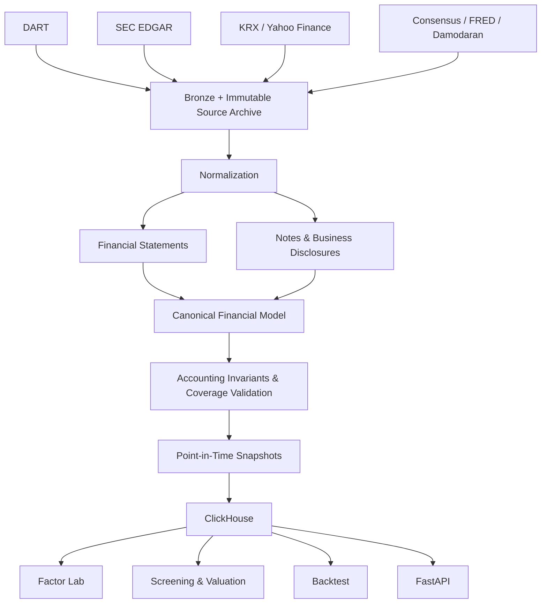

# Arcana

> **Financial Disclosure ELT & Factor Research Platform**

Arcana는 DART와 SEC EDGAR 공시를 **Point-in-Time 금융 데이터**로 정규화하고,
재무 팩터 계산부터 스크리닝·밸류에이션·백테스트까지 연결하는 금융 데이터 플랫폼입니다.
단순한 데이터 수집보다 공시 시점, 계정 문맥, 원문 추적 가능성, 회계 검증처럼
금융 리서치의 신뢰도를 좌우하는 문제에 초점을 맞춥니다.

## Architecture



## Why Arcana

재무 데이터는 API에서 숫자를 받아 저장하는 것만으로 완성되지 않습니다.

- 같은 계정명도 재무제표의 section, context, 상위 계정에 따라 의미가 달라집니다.
- 연결·별도 재무제표와 기업별 taxonomy가 뒤섞여 있습니다.
- 정정공시는 이미 수집한 과거 값을 바꿀 수 있습니다.
- 공시되기 전의 정보를 사용하면 백테스트에 look-ahead bias가 생깁니다.
- 데이터가 만들어진 과정과 원문을 추적할 수 없으면 오류를 재현하기 어렵습니다.

Arcana는 서로 다른 시장과 공시 체계를 공통 금융 모델로 변환하고, 각 숫자가
**언제 알려졌고 어디에서 왔으며 어떤 규칙을 통과했는지** 함께 보존합니다.

## Core design decisions

| 설계 원칙 | 구현 방식 |
| --- | --- |
| **Point-in-Time** | DART 접수일과 SEC 공시일 등 `report_date`를 정보 이용 가능 시점으로 사용해 미래 공시가 과거 스냅샷에 섞이지 않도록 합니다. |
| **Canonicalization** | 계정명뿐 아니라 statement section, context, parent path와 시장별 YAML 규칙을 이용해 DART·SEC의 표현을 공통 canonical account로 변환합니다. |
| **Data Quality** | `Assets = Liabilities + Equity` 등의 회계 invariant, 필수 계정, 중복, mapping coverage를 검증하고 낮은 신뢰도의 행을 진단 대상으로 분리합니다. |
| **Reproducibility** | 원문, 접수번호, URL, SHA-256, 실행 manifest와 버전 관리되는 규칙 파일을 연결해 파생 결과에서 source까지 역추적할 수 있게 합니다. |

## What it does

### Financial data ELT

- 한국: DART 공시·주석·사업보고서, KRX 가격·주식수·배당·벤치마크
- 미국: SEC Company Facts·filing notes, Yahoo Finance 가격·배당
- 컨센서스: 한국 리포트 데이터와 미국 Finnworlds·FMP·Alpha Vantage·Yahoo Finance
- 거시·자본비용 입력: FRED 금리, Damodaran ERP, 시장 벤치마크
- Bronze → Silver → Gold 계층과 ClickHouse 적재

### Financial modeling

- KR/US 재무제표 canonicalization과 기간화(annual, quarterly, TTM)
- ROIC, NOPAT, FCF, WACC, beta와 가치·수익성·배당 팩터
- K-Ratio, Equity Duration, RIM upside 등 고급 팩터
- 제품·부문별 매출, 수량, ASP, 원가를 이용한 P/Q/C operating metric
- 공시일 기준 추정치·컨센서스 history

### Research & serving

- ClickHouse 일별 factor snapshot과 as-of 조회
- 범용 factor screening, style score, sector/leader 분석
- factor graph 실험, multiple valuation band, factor backtest
- 재무제표·팩터·컨센서스·밸류에이션용 FastAPI

## Built for recoverable operations

통합 갱신은 원천 파일을 곧바로 덮어쓰지 않습니다.

1. 시장별 lock을 획득하고 새 source를 staging 영역에 받습니다.
2. 파일 형식과 내용을 검증합니다.
3. 기존 source의 SHA-256 보관본과 실행 manifest를 생성합니다.
4. 검증이 끝난 파일만 atomic replace합니다.
5. 실패하면 기존 데이터를 유지하고, 다음 실행은 checkpoint에서 재개합니다.

공급자별 rate limit, retry/backoff와 종목 단위 checkpoint도 별도로 관리합니다.

## Outputs

| 계층 | 대표 산출물 | 용도 |
| --- | --- | --- |
| Bronze | DART/SEC 원문, 공급자 응답, source archive | 원본 보존과 재처리 |
| Silver | canonical financial statements, 가격·배당·컨센서스 | 시장 간 정규화 |
| Gold | operating metrics, estimates, validation reports | 분석 가능한 데이터 제품 |
| ClickHouse | raw factors, PIT snapshots, scores | 빠른 as-of 조회와 연구 |
| API | financials, factors, screening, valuation, backtest | 애플리케이션과 리서치 도구 연동 |

대표 API 경로는 다음과 같습니다. FastAPI를 실행하면 `/docs`에서 전체 schema와
요청·응답 예시를 확인할 수 있습니다.

```text
GET  /api/financials/{stock_code}
GET  /api/financials/{stock_code}/ratios
GET  /api/valuations/{stock_code}/multiple-bands
POST /api/factor-screen/screen
POST /api/backtests/factor
POST /api/factor-lab/runs
```

## Quick start

가상환경을 활성화하고 필요한 API key와 ClickHouse 접속 정보를 환경변수로 설정한 뒤
저장소 루트에서 실행합니다.

```powershell
python -m engine.workflows.refresh --market kr
python -m engine.workflows.score_cli build-factor-scores --trade-date 2026-07-24 --factor-asof-mode asof --financial-basis annual --include-financials
python -m pytest tests -q
```

시장별 부분 실행, backfill, dry-run, loader 옵션과 환경변수 설정은
[운영 및 CLI 가이드](docs/OPERATIONS.md)에 정리되어 있습니다.

## Tech stack

- **Data & modeling:** Python, pandas, NumPy, YAML rule sets
- **API:** FastAPI, Pydantic
- **Storage:** file-based Bronze/Silver/Gold data lake, ClickHouse
- **Sources:** DART, SEC EDGAR, KRX, Yahoo Finance, FRED, Damodaran 및 consensus providers
- **Operations:** PowerShell workflows, atomic file replacement, checkpoints, pytest

## Current limitations

- 실제 수집과 적재에는 공급자별 API key 및 실행 중인 ClickHouse가 필요하며, 데이터 범위는 공급자의 구독·호출 한도에 영향을 받습니다.
- 통합 refresh는 raw factor와 snapshot까지 갱신하지만 factor/style score 생성은 별도 명령으로 실행합니다.
- 미국 consensus factor에는 아직 최대 유효기간 정책이 없어 수집 중단 시 마지막 값이 계속 사용될 수 있습니다.
- `equity_duration_20y`는 현재 KR만 지원하며, RIM이 지원하는 financial basis는 시장별로 다릅니다.

## Documentation

- [운영 및 CLI 가이드](docs/OPERATIONS.md) — 환경 설정, 전체 ELT 명령, backfill, loader, 검증 및 장애 복구
- [API 명세](API_SPEC.md) — REST API 계약과 데이터 모델
